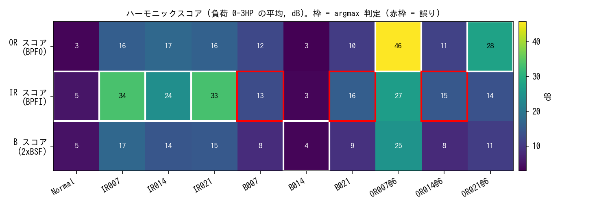

# bearing-diag-lab

CWRU Bearing Data Center の公開データを使って、軸受の故障種別をエンベロープ解析で言い当てる実験と、「診断精度 99%」という定番の数字がどこから来るのかを確かめる評価実験の置き場です。

解説記事: [その 99% は、故障ではなく「収録」を当てていた ―― 軸受診断の定番データを、幾何の予言で確かめなおす](https://zenn.dev/logicia32/articles/2026-07-09-bearing-envelope-leak)



## 使い方

```bash
pip install -r requirements.txt
cd tools
python download_cwru.py      # 公式サイトから 40 ファイル (約 134MB) を取得
python cwru.py               # 読み込み検証 (レコード一覧を表示)
python diagnose.py           # エンベロープ解析 + 幾何予言の argmax 判定
python classify_tenclass.py  # 定番の 10 クラス x ランダム分割を再現
python classify_loadleak.py  # 負荷またぎ評価 (個体リークのデモ)
python classify_sizeleak.py  # キズサイズまたぎ評価 (別個体でのテスト)
python make_figs.py          # 記事の図 3 枚を figures/ に生成
```

補助スクリプト:

| ファイル | 中身 |
|---|---|
| `inspect_cwru.py` | .mat の中身を素朴に覗く。99.mat の変数混入に気づいた経緯の再現 |
| `verify_normal_fs.py` | 正常データの fs 判定 (結論 48kHz)。一度 12kHz と誤判定した顛末もコメントに残してある |
| `band_sweep_ball.py` | 転動体レコードの共振帯を 6 通り掃引。2xBSF がどの帯域でも立たないことの確認 |
| `features.py` | 窓特徴量 3 系統 (時間統計 / 帯域エネルギー / 欠陥次数スコア) と分類器の共通部品 |

## 主な結果

- 機械学習なしの argmax 判定: 内輪 12/12、外輪 8/12 (0.014 のみ 0/4)、転動体 2/12
- 10 クラス x ランダム分割: 帯域エネルギー 16 個 + ロジスティック回帰だけで 99.7%
- 同じ特徴量でキズサイズまたぎ: 68.1% (テストサイズ 0.014 では 33.3% = 3 クラスのあてずっぽう)
- 物理特徴 (欠陥次数スコア): 68.6%。誤りは転動体と外輪 0.014 に集中し、エンベロープ解析の限界と一致

数字の意味と落とし穴は記事のほうに書いています。

## データについて

計測データは再配布していません。`download_cwru.py` が公式サイトから直接取得します (`data/raw/` は git 管理外)。

出典: [Case Western Reserve University Bearing Data Center](https://engineering.case.edu/bearingdatacenter)

参考文献: W. A. Smith and R. B. Randall, "Rolling element bearing diagnostics using the Case Western Reserve University data: a benchmark study," Mechanical Systems and Signal Processing, Vol. 64-65, 2015.

## 動作環境

Python 3.10 以降。依存は numpy / scipy / scikit-learn / matplotlib のみです。`make_figs.py` の日本語ラベルには IPA ゴシックなどの日本語フォントが必要です。

## License

MIT
